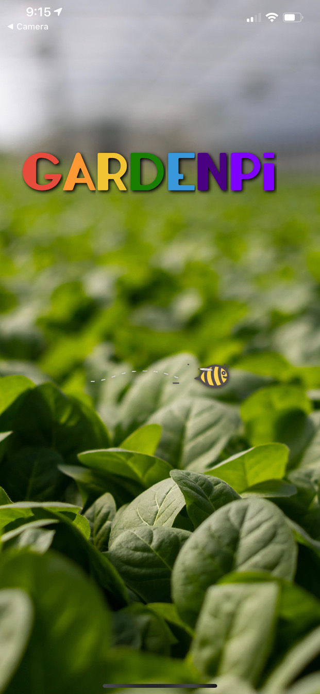

# GARDENPi FE

## Created By:

### FE TEAM
David Engel (https://github.com/David5280)<br />
Colby Allen (https://github.com/colbyallen012)
### BE Team
Rob Stringer (https://github.com/Mycobee)<br />
Billy Urrutia (https://github.com/CosmicSpagetti)<br />
Brian Plantico (https://github.com/bplantico)

## Summary

This is the front-end repository for the **GardenPi** application.  *GardenPi* is a mobile app for plant and gardening lovers who wish they had more control over their garden.  As you may have guessed, this repository pairs with the [*GardenPi* back-end repository](https://github.com/Mycobee/garden_pi_be) to create a complete application capable of synchronizing with a [raspberry-pi](https://www.raspberrypi.org/) to connect the user to their garden in situations where it was previously impossible.  *GardenPi* not only allows a user to monitor their beloved plants soil moisture saturation by most recent, last five recordings, and over the coarse of a week... It also allows the user to water their garden remotely via the 'Water Garden' button.  Additionally, weather data is displayed under the *GardenPi* logo so the user is made aware of current and upcoming conditions.

When the user first opens the app, they're greeted by a splash page that loads the necessary data and displays an activity indicator as these fetch calls are made.  One data is present, a button reading "Enter My Garden" appears.  This button takes the user to the home page, which displays current weather data near the top of the screen, followed by a graph showing the last five readings of their plants soil moisture saturation.  Below this graph are two data circles which displays the most recent soil moisture saturation as well as the local temperature.  To the left of the logo is a back arrow to access the splash page once again, and to the right of the logo is a camera icon which opens the app's camera.  Both front and rear cameras are operational, and a picture preview is displayed once a photo is taken.  The user can either choose to keep or re-take the photo before saving to their local camera role.

The home page is also where the "Water Garden" button lives.  When this button is pressed with the proper equiptment assembled, it will trigger a water pump that waters the garden for a pre-specified amount of time, no matter where in the world the user might be at that time.  To the left of the 'Water Garden' button is another button reading 'More Data' which takes the user to the data page.

On the data page the user can find a seven day weather forecast near the top of the app.  Below this forecast is another graph that displays daily average soil moisture saturation going back one week.  Finally, under this graph is a the recent photo area.  This area exists so the user can attach a camera to the raspberry pi and have photos automatically taken and sent to the app throughout the day.  The frequency of automatic photo capability is up to the user's discretion.   


### Learning Goals & Requirements

1.  Ultimately, demonstrate knowledge you’ve gained throughout Turing
2.  Use an agile process to turn well defined requirements into deployed and production ready software
3.  Gain experience dividing applications into components and domains of responsibilities to facilitate multi-developer teams. Service oriented architecture concepts and patterns are highly encouraged.
4.  Explore and implement new concepts, patterns, or libraries that have not been explicitly taught while at Turing
5.  Practice an advanced, professional git workflow (see whole-team expectations)
6.  Gain more experience using continuous integration tools to build and automate the deployment of features in various environments
7.  Build applications that execute in development, test, CI, and production environments
8.  Focus on communication between front-end and back-end teams in order to complete and deploy features that have been outlined by the project spec


##  Installation
*While this application can be downloaded can experimented with, the user will not have much functionality without a raspberry pi and the proper equipment and assembly to be able to monitor, interact with, and observe their garden.*

1.  clone this repo to your local machine
2.  run npm install to download all necessay dependencies
3.  run ```npm start``` to run the server
4.  either run iOS simulator or scan QR code with iPhone camera
5.  experiment with the different functionalities & and cutomize automation throughout your garden!


###  Preview
#### Loading Splash Page
 
 #### Loaded Splash Page
 
 #### Home/Current Data Page
 
 #### Extended Data Page
 
  #### Camera View
 

